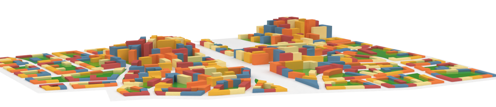

# Shape to Fabrication 2025 - Workshop Script to Deploy

A workshop to be presented on Tuesday April 15th, 2025 for Shape to Fabrication 2025

This workshop will introduce the Rhino 8 Script Editor, a new integrated development environment for Rhino 8. You will learn how to code a command in Python or C#, implement a Grasshopper component, create a Rhino ScriptEditor project and build a Rhino plug-in and Grasshopper add-in, all without leaving the new Script Editor.

This repository contains the files for the workshop and the GitHub CI/CD pipelines to facilitate building, testing and deployment.

## Workshop Tutors

|  |  | 
| ------------- | ------------- |
|[Ehsan Iran-Nejad](https://www.linkedin.com/in/eirannejad/)|[Menno Deij - van Rijswijk](https://www.linkedin.com/in/mennodeij)|
